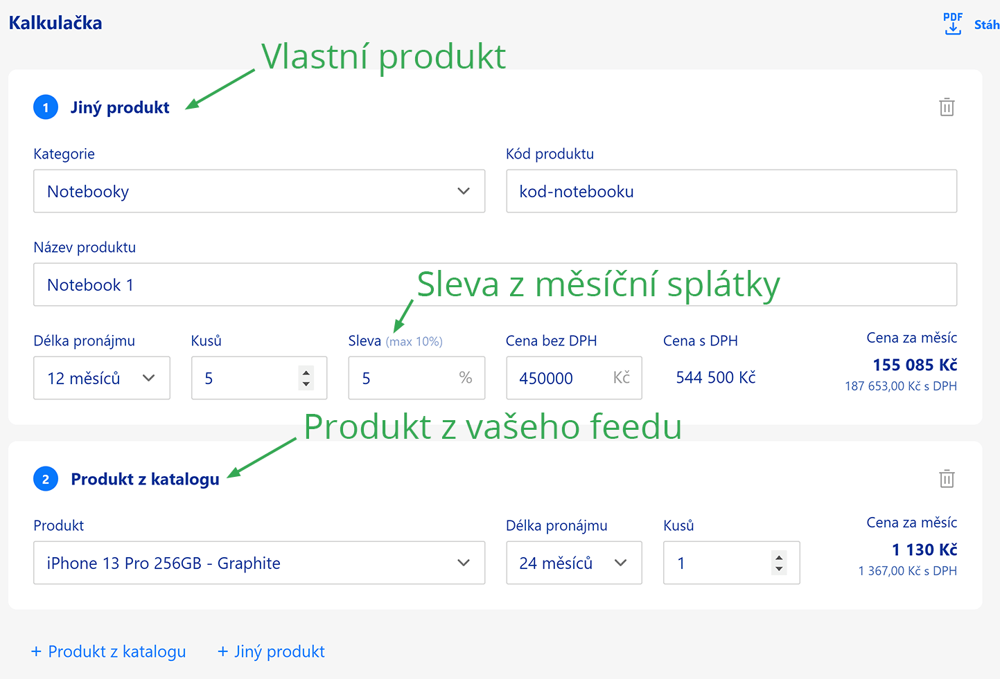

# Nevidím slevu

V pohledu pro obchodníky nemám možnost vložit slevu.

## Popis problému

- V [pohledu pro obchodníky](../tutorial-implementace/pro-obchodniky) nemám možnost přidat slevu k vlastnímu zboží.

[Odkaz na obrázek](../../static/img/sleva.png)

## Řešení problému

- K přidání slevy nemáte přidělené oprávnění. Pokud si myslíte, že se jedná o chybu, [kontaktujte nás](../kontakt).
