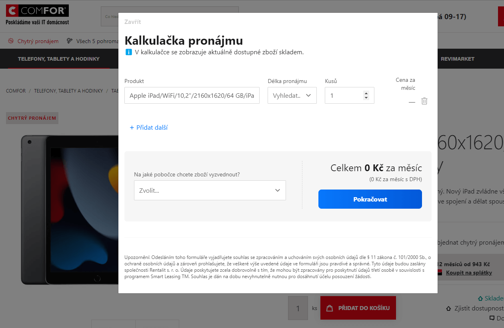

# Embedované řešení

Popis řešení vloženého přímo do webu.

## Co je to embedované řešení

Embedované řešení je způsob, kterým je kalkulačka Rentalit Pro vložena přímo do vašeho webu. Vše je implementováno pomocí chytrého `iframe`, který využívá knihovnu `iframeResizer`, která zajistí, že se embed plně přizpůsobí kontejneru, do kterého jste `iframe` vložili.

:::tip

Vstupními parametry embedu je možné v kalkulačce předvyplnit zboží, které si klient u vás objednává.

:::

## Jaké jsou možnosti implementace

- Embed můžete vložit například do modálního okna, které se otevře po kliknutí na nákupní tlačítko na vašem webu.
- Embed můžete také vložit rovnou do webu na stránku produktu.

V obou případech doporučujeme přenést vstupními parametry zboží, které má být v kalkulačce vložené.

- Embed je možné vložit na samostatnou stránku i bez předání vstupních parametrů, nicméně je to pro klienta nepraktické.

## Jak embed nainstalovat?

Na libovolné místo na vašich stránkách vložte následující integrační snippet:

```html
<!-- Rentalit Leasing Calculator -->
<div id="rentalit"></div>
<script src="https://rentalitpro.cz/js/rentalit.js"></script>
<script>Rentalit({hash: "VÁŠ_UNIKÁTNÍ_HASH"}, "#rentalit")</script>
<!-- END Rentalit Leasing Calculator -->
```

`VÁŠ_UNIKÁTNÍ_HASH` je [unikátní hash](../tutorial-zaklady/jak-to-funguje#pojmy), kterým se v Rentalit Pro identifikujete. Embed díky tomu bude zobrazovat správný katalog a whitelabel styly. Hash nezbytnou součástí.

Pro testovací účely můžete použít hash `xZnzAeXHWa6cBvZXtjnJB1EthBPzFrxA3dibZNlcbNENFbWnzPptpI1DC9QHibQa`.

## Konfigurace vstupních parametrů

### Hash `[string]` _(povinné)_

Váš ověřovací hash do Rentalit Pro.

Např. `xZnzAeXHWa6cBvZXtjnJB1EthBPzFrxA3dibZNlcbNENFbWnzPptpI1DC9QHibQa`

Defaultní hodnota: `žádná`

### Products `[array]` _(doporučené)_

Pole produktů, které chcete v embedu automaticky předvybrat. Produkty je možné identifikovat podle `product_code` (katalogový kód zboží) nebo `product_id` (unikátní identifikátor produktu).

Ukázka:

```json
products: [
   { product_id: 156 },
   { product_id: 157 },
   { product_id: 55 },
   { product_id: 252 },
   { product_code: "D-N-3590-N3-513" }
]
```

Defaultní hodnota: `[]`

### Debug `[boolean]`

Zapíná extenzivní logování stavů embedu do konzole. Slouží pro identifikaci případných problémů s integrací. Hodnotu `true` důrazně nedoporučujeme pro produkční prostředí.

Defaultní hodnota: `false`

### Stage `[boolean]`

Přepne embed na testovací prostředí (stage) Rentalit Pro. Používá se v případě testování nových funkcí nebo změn, které ještě nejsou dostupné na produkci.

:::caution Pozor
Pro správnou funkci je nutné při zapnutí tohoto parametru zároveň změnit URL skriptu ve snippetu z `https://rentalitpro.cz/js/rentalit.js` na `https://stage.rentalitpro.cz/js/rentalit.js`!
:::

Defaultní hodnota: `false`

### Standalone `[boolean]`

Slouží k aktivaci standalone režimu, který přidá kolem embedu pozadí a vaše logo tak, aby šel embed použít na samostatné stránce bez nutnosti dalšího stylování.

Defaultní hodnota: `false`

:::info

Více informací o standalone režimu se dozvíte v [další části návodu](standalone-reseni).

:::

## Ukázka embedovaného řešení

[](../../static/img/embed-v-modalnim-okne.png)
[Odkaz na obrázek](../../static/img/embed-v-modalnim-okne.png)

Pro další ukázky se můžete podívat do kategorie [ukázek řešení](../tutorial-zaklady/ukazky-reseni-embed).

## DEMO

Pro vyzkoušení, jak má integrace vypadat, jsme vytvořili následující dema:

- [Minimální implementace](https://codepen.io/matousjanda/pen/jOmeYrZ?editors=1010)
- [Embed s předvyplněnými produkty](https://codepen.io/matousjanda/pen/MWmNeKO?editors=1010)
